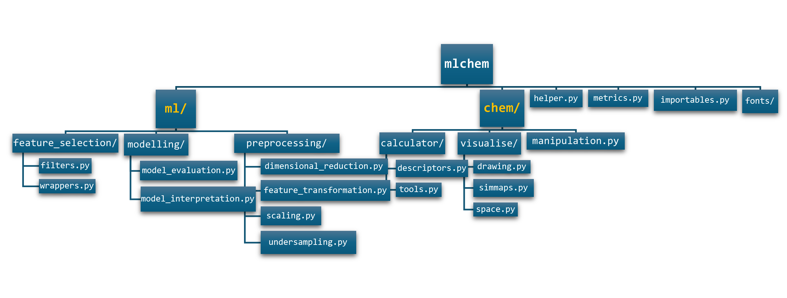
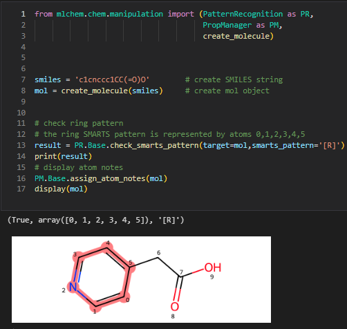
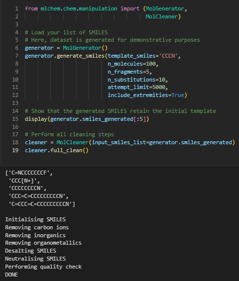
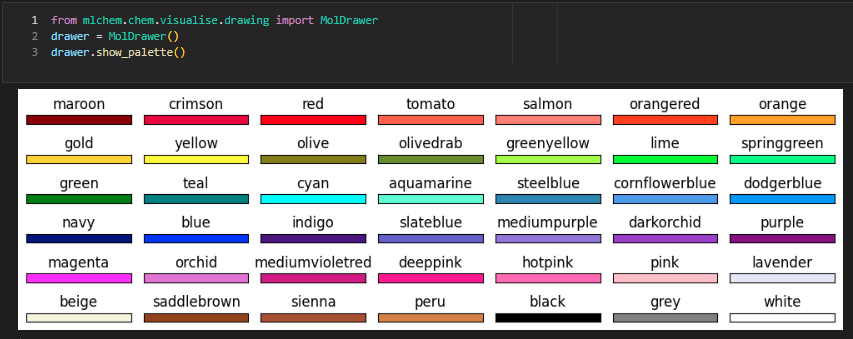
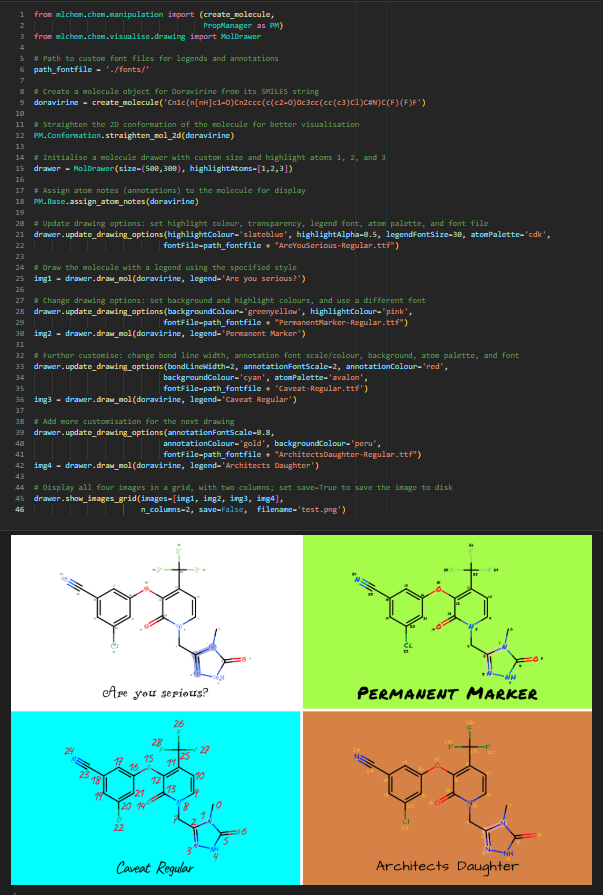

# mlchem

[](https://www.python.org/)
[](https://www.rdkit.org/)

**mlchem** is a Python cheminformatics library designed for the scientific community. It provides a comprehensive set of tools for data handling, molecule manipulation, drawing, machine learning, and plotting.
The library has been tested for python 3.11, 3.12 and 3.13.

## Documentation

Available at https://seacunilever.github.io/mlchem/

## Features

- **Data Handling**: Efficiently manage and process chemical data, including loading, cleaning, and transforming datasets.
- **Molecule Manipulation**: Tools for manipulating molecular structures, such as adding or removing atoms, modifying bonds, and generating molecular conformations.
- **Pattern Recognition**: An extensive list of functions to search for specific structural patterns.
- **Molecule Drawing**: Visualise molecules with customisable drawing options, creating high-quality images for presentations and publications.
- **Machine Learning**: Implement machine learning models for cheminformatics, including training, evaluating, and deploying models to predict chemical properties and activities.
- **Feature Analysis and Interpretation**: Interpret model features and provide insightful plots.

## Architecture




## Modules

### chem.visualise/

- **space.py**: Computes and visualises datasets in a lower-dimensional space.
- **simmaps.py**: Generates "rdkit-like" similarity maps based on atomic importance weights.
- **drawing.py**: Handles the drawing of molecular structures with many customisable options.

### chem.calculator/

- **tools.py**: Provides numerous tools for chemical calculations.
- **descriptors.py**: Calculates various descriptors for molecules, including RDKit and Mordred descriptors, atomic descriptors, chemotypes, fingerprints, and some quantum chemistry properties.

### chem.manipulation.py

The `mlchem.chem.manipulation` module offers a variety of tools for creating, converting, manipulating molecular structures, generate new molecules and recognise molecular patterns.

### ml.feature_selection/

- **filters.py**: Provides functionalities for filtering features.
- **wrappers.py**: Offers simplified interfaces for feature selection.

### ml.modelling/

- **model_interpretation.py**: Provides tools for interpreting machine learning models.
- **model_evaluation.py**: Contains tools for evaluating machine learning models.

### ml.preprocessing/

- **dimensional_reduction.py**: Provides functionalities for compressing dataframes using various dimensionality reduction techniques.
- **feature_transformation.py**: Expands features to polynomial features.
- **scaling.py**: Provides functionalities for scaling dataframes using different scaling techniques.
- **undersampling.py**: Contains techniques for handling imbalanced datasets.

## Installation

### Option 1

To install **mlchem**, open your command prompt and, after navigating to the folder where your python packages are usually installed: (change {your_user_name} and {3xx} with your user name and python version)

```bash
C:\Users\{your_user_name}\AppData\Roaming\Python\Python{3xx}\site-packages
```

And then install dependencies

```bash
pip install -r mlchem/requirements.txt
```

### Option 2

use the following command:

```bash
pip install git+https://github.com/seacunilever/mlchem.git
```

### Option 3

Alternatively, latest release from PiPy (not available yet):

```bash
pip install mlchem
```

### Option 4

Development installation, to modify the code or contribute with some changes:

```bash

# Create a virtual environment
python3 -m venv _venv
. ./_venv/bin/activate

# On Windows:
use .\_venv\Scripts\activate

# Clone the repository
git clone https://github.com/seacunilever/mlchem
cd mlchem

# Make an editable install of mlchem from the source tree
pip install -e .

# and install requirements
pip install -r requirements.txt
```

## Usage

Here's some basic examples of how to use **mlchem**:

### calculate rdkit descriptors for two molecules
```python
from mlchem.chem.manipulation import create_molecule
from mlchem.chem.calculator import descriptors
mol1 = create_molecule('c1ccccc1CCCO')
mol2 = create_molecule('CCCCCN')
desc_df = descriptors.get_rdkitDesc([mol1, mol2],include_3D=True)
```
### pattern recognition


### de novo molecule generation and cleaning


### show pre-defined colour palette


### explore molecule drawing options


More examples in the [examples](https://github.com/seacunilever/mlchem/tree/master/examples) folder.

## Contributing

We welcome contributions to **mlchem**. Users are free to propose new functionalities, flag new bugs, fix old bugs and issue pull requests. Please consult the guide (work in progress) on how to properly submit pull requests.

## Third-Party Dependencies

This project uses the [SELFIES](https://github.com/aspuru-guzik-group/selfies) Python package for molecular string representations.  
SELFIES is licensed under the [Apache License 2.0](https://www.apache.org/). In accordance with its license, the relevant license is included in this repository.

This project uses and adapts code from the [RDKit](https://www.rdkit.org) cheminformatics toolkit, which is licensed under the [BSD 3-Clause License](https://interoperable-europe.ec.europa.eu/licence/bsd-3-clause-clear-license).

## License

This project is licensed under the BSD-3 License.

Note: This project includes components licensed under the Apache License 2.0 (e.g., the SELFIES package), as well as source code taken and adapted from RDKit library.


## Acknowledgements

Special thanks to the Safety, Environmental & Regulatory Science (SERS) Department at Unilever.


