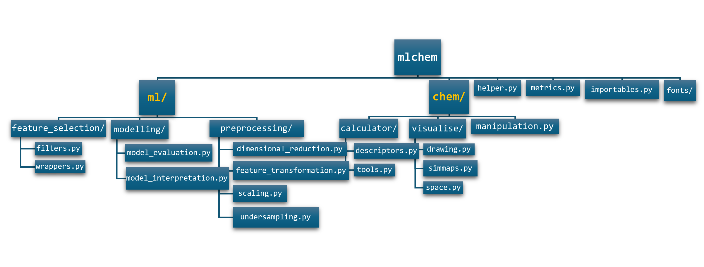
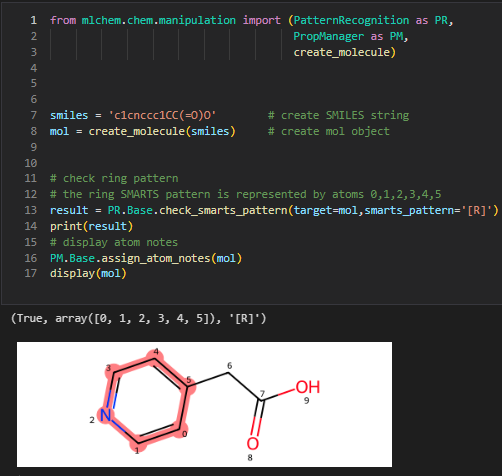
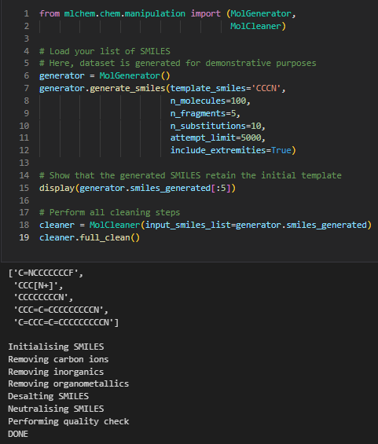
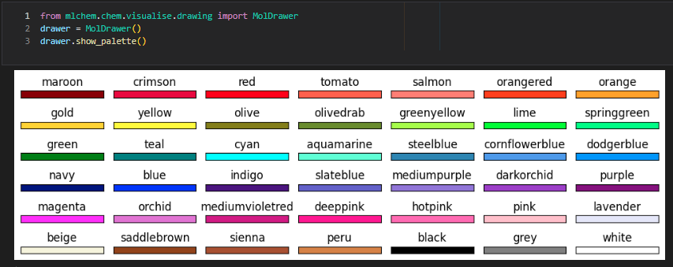

# mlchem

[](https://www.python.org/)
[](https://www.rdkit.org/)
[](assets/coverage.svg)
[](assets/coverage-branch.svg)

**mlchem** is a Python cheminformatics library designed for the scientific community. It provides a comprehensive set of tools for data handling, molecule manipulation, drawing, machine learning, and plotting.
The library has been tested for python 3.12, 3.13 and 3.14 (experimental).

## Documentation

Available at [seacunilever.github.io/mlchem](https://seacunilever.github.io/mlchem/).

## Features

- **Data Handling**: Efficiently manage and process chemical data, including loading, cleaning, and transforming datasets.
- **Molecule Manipulation**: Tools for manipulating molecular structures, such as adding or removing atoms, modifying bonds, and generating molecular conformations.
- **Pattern Recognition**: An extensive list of functions to search for specific structural patterns.
- **Molecule Drawing**: Visualise molecules with customisable drawing options, creating high-quality images for presentations and publications.
- **Machine Learning**: Implement machine learning models for cheminformatics, including training, evaluating, and deploying models to predict chemical properties and activities.
- **Feature Analysis and Interpretation**: Interpret model features and provide insightful plots.

## Architecture




## Modules

### chem.visualise/

- **space.py**: Computes and visualises datasets in a lower-dimensional space.
- **simmaps.py**: Generates "rdkit-like" similarity maps based on atomic importance weights.
- **drawing.py**: Handles the drawing of molecular structures with many customisable options.

### chem.calculator/

- **tools.py**: Provides numerous tools for chemical calculations.
- **descriptors.py**: Calculates various descriptors for molecules, including RDKit and Mordred descriptors, atomic descriptors, chemotypes, fingerprints, and some quantum chemistry properties.

### chem.manipulation.py

The `mlchem.chem.manipulation` module offers a variety of tools for creating, converting, manipulating molecular structures, generate new molecules and recognise molecular patterns.

### ml.feature_selection/

- **filters.py**: Provides functionalities for filtering features.
- **wrappers.py**: Offers simplified interfaces for feature selection.

### ml.modelling/

- **model_interpretation.py**: Provides tools for interpreting machine learning models.
- **model_evaluation.py**: Contains tools for evaluating machine learning models.

### ml.preprocessing/

- **dimensional_reduction.py**: Provides functionalities for compressing dataframes using various dimensionality reduction techniques.
- **feature_transformation.py**: Expands features to polynomial features.
- **scaling.py**: Provides functionalities for scaling dataframes using different scaling techniques.
- **undersampling.py**: Contains techniques for handling imbalanced datasets.

## Installation

To install **mlchem**, open your command prompt and use the following command:

```bash
pip install git+https://github.com/seacunilever/mlchem.git
```

When a release is published to PyPI, install with:

```bash
pip install mlchem
```

Development installation, to modify the code or contribute with some changes:

```bash
# Clone the repository
git clone https://github.com/seacunilever/mlchem
cd mlchem

# (Optional: create a virtual environment)
python -m venv _venv

# Activate on macOS/Linux:
source _venv/bin/activate

# Activate on Windows (PowerShell):
.\_venv\Scripts\Activate.ps1

# Activate on Windows (cmd.exe):
_venv\Scripts\activate.bat

# Make an editable install of mlchem from the source tree
pip install -e .

# and install requirements
pip install -r requirements.txt
```

## Logging

**mlchem** emits diagnostic logs during pipeline execution (feature selection, model evaluation, data preprocessing) to help users track progress and debug issues. Logs are emitted at the `INFO` level by default and appear on the console.

### Basic Usage

Logs appear automatically when running mlchem functions:

```python
from mlchem.ml.feature_selection.wrappers import SequentialForwardSelection
from mlchem.metrics import get_geometric_S

sfs = SequentialForwardSelection(estimator=..., metric=get_geometric_S, ...)
sfs.fit(X_train, y_train, X_test, y_test)
# Logs appear on console: e.g., "10:35:55 - mlchem.ml.feature_selection.wrappers - INFO - SFS start: ..."
```

### Controlling Log Level

Change the logging level to filter output (e.g., show only warnings, suppress info messages):

```python
sfs = SequentialForwardSelection(..., log_level='WARNING')
sfs.fit(...)  # Only WARNING+ logs appear
```

Valid log levels: `DEBUG`, `INFO`, `WARNING`, `ERROR`, `CRITICAL`

### Post-Pipeline Inspection and File Logging

Capture logs to memory or file for later inspection without modifying function calls:

```python
from mlchem.helper import start_logging

# Capture to console + memory
logs = start_logging(log_level='INFO', to_console=True)
sfs.fit(X_train, y_train, X_test, y_test)
print(logs.get_logs())  # View captured logs

# Capture to file + console
logs = start_logging(log_level='INFO', to_file='pipeline.log')
sfs.fit(...)
# Logs written to pipeline.log + displayed on console

# Capture to file only (silent)
logs = start_logging(to_console=False, to_file='pipeline.log')
sfs.fit(...)  # Silent; logs only in file
```

Use this for non-interactive scripts and production environments.

## Compatibility checks (Python 3.12, 3.13, 3.14)

This repository now includes a local matrix runner and CI workflow scaffold to
keep cross-version support visible on every push.

For most local development, running `python -m pytest -vv tests` from repo root is enough. The commands in
this section are mainly for maintainers, release checks, or contributors who
want local parity with CI across multiple Python versions.

Prerequisite for all commands below: activate your project virtual environment first.

Warning policy note:

- A narrowly scoped `pytest` warning filter is used for an upstream SHAP
  `PendingDeprecationWarning` (`shap.plots.colors._colors`) tied to matplotlib
  colormap API changes.
- Keep this filter temporary and remove it once SHAP resolves the upstream issue.
- To periodically audit all warnings explicitly, run:

```bash
python -m pytest -vv tests -W default
```

Coverage baseline (canonical: Python 3.12):

```bash
python -m pytest -vv tests --cov=mlchem --cov-config=.coveragerc --cov-branch --cov-report=term --cov-report=xml:coverage.xml
python - <<'PY'
import xml.etree.ElementTree as ET
root = ET.parse('coverage.xml').getroot()
line_pct = round(float(root.get('line-rate', 0.0)) * 100)
branch_pct = round(float(root.get('branch-rate', 0.0)) * 100)
print(f'line={line_pct}, branch={branch_pct}')
PY
python -m anybadge --label "line cov" --value <LINE_PERCENT> --file assets/coverage.svg --overwrite 50=red 60=orange 70=yellow 80=yellowgreen 90=green
python -m anybadge --label "branch cov" --value <BRANCH_PERCENT> --file assets/coverage-branch.svg --overwrite 50=red 60=orange 70=yellow 80=yellowgreen 90=green
```

Note: both badges (`assets/coverage.svg` for line coverage and `assets/coverage-branch.svg` for branch coverage) are refreshed automatically by GitHub CI on push (py312 job), so local regeneration is optional and mainly useful for previewing changes before pushing.

Current policy:

- Python 3.12 and 3.13 are required to pass.
- Python 3.14 is currently experimental (reported, not blocking).

### Local matrix (default envs under ~/Envs)

The matrix helper expects existing Python environments (for example py312, py313, py314). If you do not use this layout, use the tox entrypoint below instead.

Run all environments in fast mode (default: no dependency reinstall):

From repository root:

```bash
python scripts/run_local_matrix.py
```

From `scripts/` directory:

```bash
python run_local_matrix.py
```

On Windows, if output appears buffered/silent, use unbuffered mode:

```bash
py -u scripts/run_local_matrix.py
```

By default, the runner streams live progress (active env/step and pytest output).

Run all environments with full dependency reinstall + tests:

```bash
python scripts/run_local_matrix.py --full-install -- -vv tests
```

Strict mode (make Python 3.14 failures blocking):

```bash
python scripts/run_local_matrix.py --strict-314 -- -vv tests
```

Quiet mode (disable live streaming and print only summary):

```bash
python scripts/run_local_matrix.py --no-live-output -- -vv tests
```

### tox entrypoint

You can also run the same idea via tox:

```bash
python -m pip install tox
```

```bash
python -m tox -e py312,py313,py314
```

The `py314` tox environment is marked non-blocking during early adoption.

## Usage

Here's some basic examples of how to use **mlchem**:

### calculate rdkit descriptors for two molecules
```python
from mlchem.chem.manipulation import create_molecule
from mlchem.chem.calculator import descriptors
mol1 = create_molecule('c1ccccc1CCCO')
mol2 = create_molecule('CCCCCN')
desc_df = descriptors.get_rdkitDesc([mol1, mol2],include_3D=True)
```

### calculate chemotypes faster on larger datasets
```python
from mlchem.chem.calculator import descriptors

smiles_list = ['CCO', 'CCN', 'COCC', 'c1ccccc1O']

# n_jobs=1 keeps serial execution (default)
# n_jobs>1 enables multi-threaded molecule processing
# n_jobs=-1 uses all available CPU cores
chemotypes = descriptors.get_chemotypes(smiles_list, n_jobs=4)
```

Performance note: chemotype execution now reuses per-molecule rule results
and avoids repeated molecule preparation. This is especially important for
large rule dictionaries and medium-to-large training sets.

### control ML verbosity in notebooks and development runs
```python
import logging
from sklearn.linear_model import LogisticRegression
from mlchem.ml.feature_selection.wrappers import (
  SequentialForwardSelection,
  CombinatorialSelection,
)

# Enable library logs in your notebook session
logging.basicConfig(level=logging.INFO)

sfs = SequentialForwardSelection(
  estimator=LogisticRegression(),
  estimator_string='lr',
  metric=lambda y_true, y_pred: (y_true == y_pred).mean(),
  verbose=True,
  log_level='INFO',
)

# Runtime toggle (use DEBUG for very verbose traces)
sfs.set_verbosity(True, 'DEBUG')
sfs.set_verbosity(False)

cs = CombinatorialSelection(
  estimator=LogisticRegression(),
  metric=lambda y_true, y_pred: (y_true == y_pred).mean(),
  verbose=True,
  log_level='INFO',
)
```

### optional diagnostics for undersampling and y-scrambling
```python
from mlchem.ml.preprocessing.undersampling import undersample
from mlchem.ml.modelling.model_evaluation import y_scrambling

# Silent by default; set verbose=True when diagnostics are needed
train_balanced, test_updated = undersample(
  train_set=train_df,
  test_set=test_df,
  class_column='class',
  desired_proportion_majority=0.6,
  verbose=True,
  log_level='INFO',
)

y_scrambling(
  estimator=model,
  train_set=X_train,
  y_train=y_train,
  test_set=X_test,
  y_test=y_test,
  metric_function=metric_fn,
  n_iter=50,
  plot=False,
  verbose=True,
  log_level='INFO',
)
```

### calculate fingerprints
```python
from mlchem.chem.calculator import descriptors

smiles_list = ['CCO', 'CCN', 'CCC']

# Morgan bit-vectors (2048 bits by default)
fp_df = descriptors.get_fingerprint_df(smiles_list, fp_type='m', nBits=2048)

# Include bit info for interpretability on a single molecule
fp, bit_info = descriptors.get_fingerprint('CCO', fp_type='m', include_bit_info=True)
```

### pattern recognition


### de novo molecule generation and cleaning


### show pre-defined colour palette



More examples in the [examples](https://github.com/seacunilever/mlchem/tree/master/examples) folder.

## Building the documentation

The documentation is built with [Sphinx](https://www.sphinx-doc.org/) using the `autodoc` and [`myst-parser`](https://myst-parser.readthedocs.io/) extensions. Source files live under `docs/source/`, build output lands in `docs/build/html/`, and a small post-build script (`docs/_publish.py`) mirrors that build into `docs/` so GitHub Pages always serves the latest version.

> Single-source content: `docs/source/welcome.md` `{include}`s this README, so you only edit `README.md` — never duplicate content into the welcome page.

### What is tracked, what is not

Only the inputs and the published output are tracked in git:

- **Tracked (do edit / commit)**
  - `docs/source/` — Sphinx inputs (`conf.py`, `*.rst`, `welcome.md`, `_static/custom.css`).
  - `docs/Makefile`, `docs/make.bat`, `docs/_publish.py` — build entry points.
  - `docs/.nojekyll` — tells GitHub Pages to keep `_static/` and `_sources/`.
  - `docs/*.html`, `docs/_static/`, `docs/_sources/`, `docs/_images/`, `docs/objects.inv`, `docs/searchindex.js` — the **published mirror** that GitHub Pages serves; updated automatically by `make html` via `_publish.py`.
- **Not tracked (regenerated on every build, ignored via `.gitignore`)**
  - `docs/build/` — Sphinx scratch output, including `build/html/.doctrees/` and `build/html/.buildinfo` incremental-build caches.
  - `docs/*warnings*.{log,txt}` — ad-hoc diagnostic logs.

### Prerequisites

The documentation toolchain is part of `requirements.txt`. If you only want the doc deps:

```bash
pip install sphinx myst-parser
```

### Build & publish

Run the commands from the `docs/` directory (NOT from `docs/source/` — `source` is the value of `SOURCEDIR` inside the `Makefile` / `make.bat`, not the working directory):

```bash
# from the repository root
cd docs

# wipe previous build artefacts (clears docs/build/)
make clean

# build HTML and automatically mirror docs/build/html/ -> docs/
make html
```

`make html` runs Sphinx and then invokes `_publish.py`, which:

1. removes every stale published asset at the root of `docs/` (everything except `source/`, `build/`, `Makefile`, `make.bat`, `_publish.py`, `.nojekyll`, `.gitignore`);
2. copies the freshly built site from `docs/build/html/` into `docs/`;
3. ensures the `.nojekyll` marker is present so GitHub Pages keeps `_static/` and `_sources/`.

Then commit the regenerated files at the root of `docs/` — that is what gets published. `docs/build/` stays local.

If you ever build with a raw `sphinx-build` invocation, run the mirror step manually:

```bash
make publish
```

On Windows the same targets are dispatched through `make.bat`, so the commands work in both `cmd` and PowerShell as long as `sphinx-build` and `python` are on the `PATH`.

> Common pitfalls: running `make html` from `docs/source/` (no `Makefile` there → "no rule" / "missing Makefile" error), or typing `make build` (the Sphinx target is `html`; `build` is the *output directory*, not a target).

## Contributing

We welcome contributions to **mlchem**. Users are free to propose new functionalities, flag new bugs, fix old bugs and issue pull requests. Please consult the [contribution guide](https://github.com/seacunilever/mlchem/blob/master/CONTRIBUTING.md) on how to properly propose and submit changes.

## Third-Party Dependencies

This project uses the [SELFIES](https://github.com/aspuru-guzik-group/selfies) Python package for molecular string representations.  
SELFIES is licensed under the [Apache License 2.0](https://www.apache.org/). In accordance with its license, the relevant license is included in this repository.

This project uses and adapts code from the [RDKit](https://www.rdkit.org) cheminformatics toolkit, which is licensed under the [BSD 3-Clause License](https://interoperable-europe.ec.europa.eu/licence/bsd-3-clause-clear-license).

## License

This project is licensed under the BSD-3 License.

Note: This project includes components licensed under the Apache License 2.0 (e.g., the SELFIES package), as well as source code taken and adapted from RDKit library.


## Acknowledgements

Special thanks to the Safety, Environmental & Regulatory Science (SERS) Department at Unilever.
